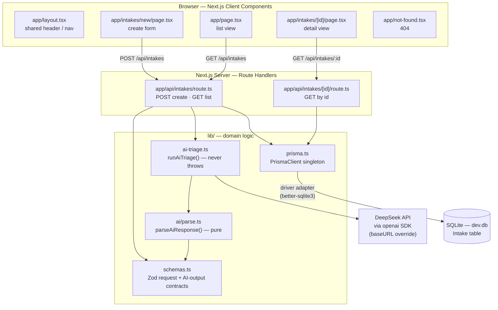
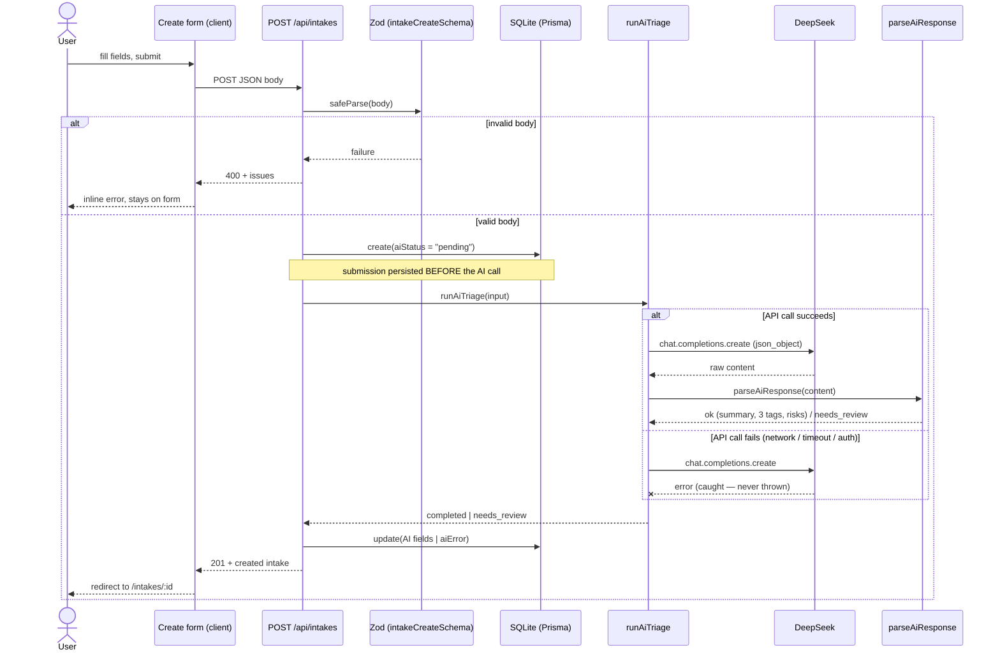
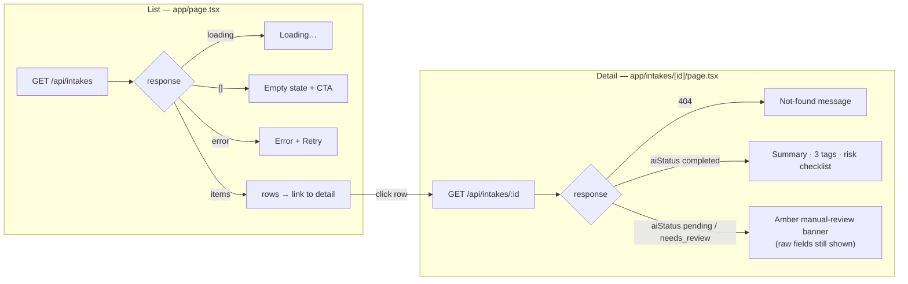
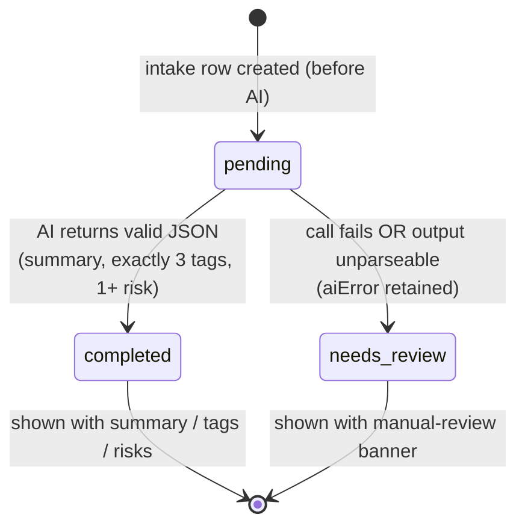

# Architecture — Project Intake Triage

Diagrams of the user flow and system components **as built**. See
[`../README.md`](../README.md) for how to run and [`../DECISIONS.md`](../DECISIONS.md)
for why these choices were made.

---

## 1. System components

How the pieces fit together: Next.js Client Components in the browser talk to
Route Handlers, which delegate to the `lib/` domain logic, the DeepSeek API, and
SQLite (via Prisma).

---

## 2. User flow — create an intake

The core path, including the **reliability guarantee**: the raw submission is
persisted *before* the AI call, and the AI call never throws — both failure
modes (call fails / output unparseable) degrade to `needs_review` instead of
losing the submission.

---

## 3. View flows — list & detail

Both views are Client Components that fetch the JSON API and render explicit
states (loading / empty / error / not-found / manual-review).

---

## 4. `aiStatus` lifecycle

Every intake row carries one of three statuses. The raw intake fields are always
present regardless of status — the AI outcome is layered on top.

